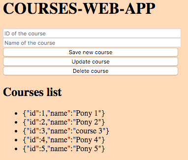

# COURSES-WEB-APP

> `Code-Along` exercise for practice javascript RESTful API, express framework to process HTTP requests.

## Table of contents
* [General info](#general-info)
* [Screenshots](#screenshots)
* [Technologies](#technologies)
* [Setup](#setup)
* [Features](#features)
* [Status](#status)
* [Contact](#contact)

## General info
The purpose of the project is to refactor again the code provided in the video [Express.js Tutorial: Build RESTful APIs with Node and Express | Mosh](https://www.youtube.com/watch?v=pKd0Rpw7O48) for implementing a CLI program and a light frontend to process the HTTP requests. [development-strategy.md](./development-strategy.md) file contains the steps used to complete this project, it describes the branches with details about the what is implemented.

## Screenshots

## Technologies
* node.js
* express framework

## Setup
You can clone or fork this repository and test the files.

## Features
The project features a web site with:
* CRUD operation processing HTTP RESTful API calls by server.
* Deployed using Heroku! [https://ferrycosv-courses-web-app.herokuapp.com/](https://ferrycosv-courses-web-app.herokuapp.com/)

## Status
Project is: finished, final version.

## Contact
Created by [@ferrycosv](www.github.com/ferrycosv) - feel free to contact me!